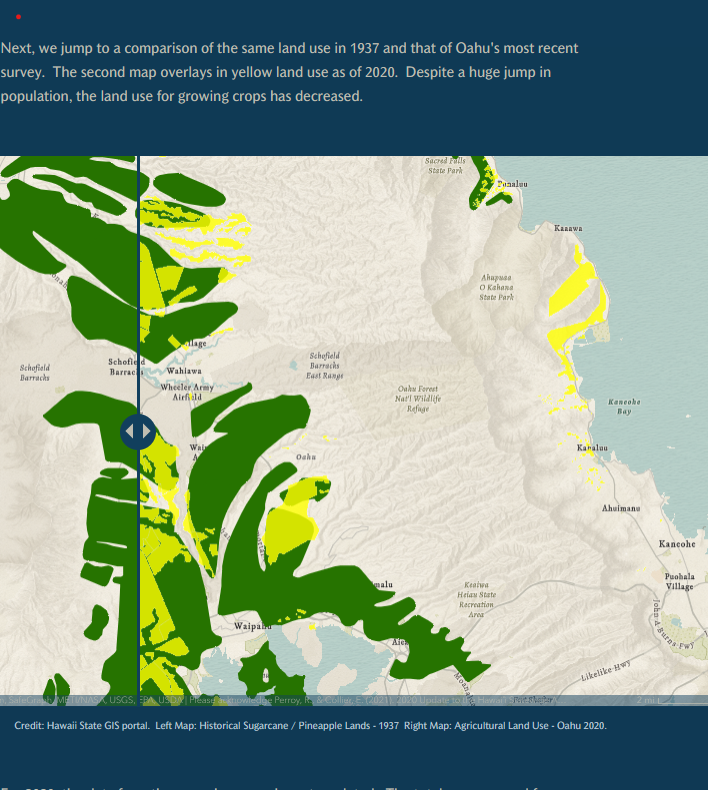
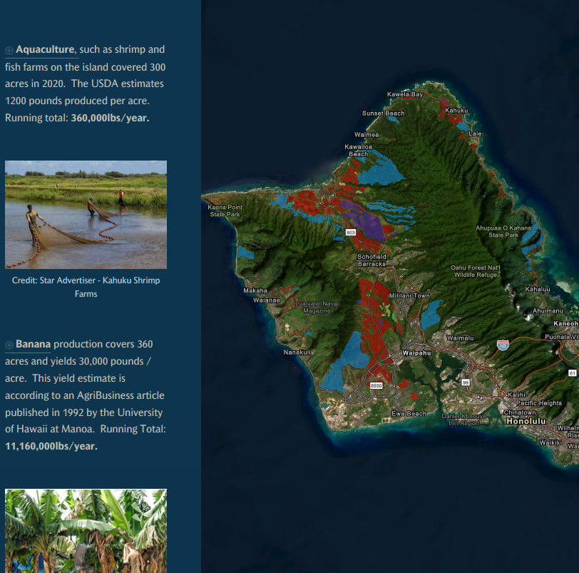
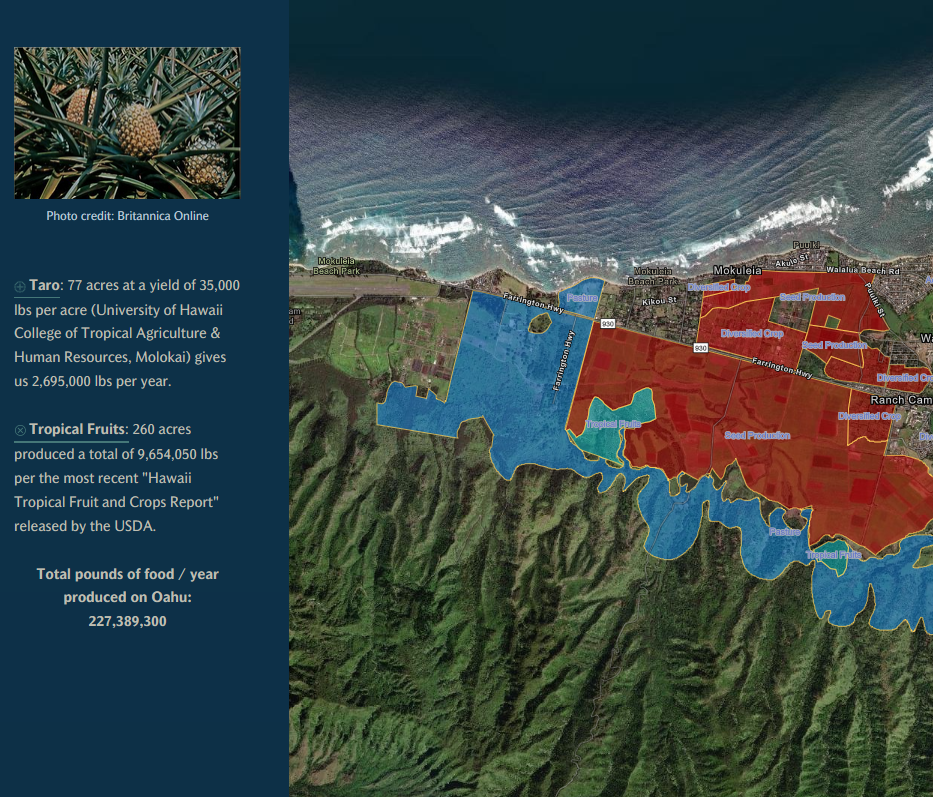

  
  
  

The goal of this project was to compile a map-centric statement on the sustainability of Oahu’s food supply.  At present, over 90% of the food that is consumed on a daily basis has to be imported.  Is there enough agriculturally zoned land on Oahu to support ourselves if we ever needed to?  

My role in this project was to take the JSON data from the State of Hawaii’s ArcGIS  portal regarding the zoning of land on island and compile onto several maps.  The data was used to evaluate the history from 1900  to present of how agricultural land has been zoned and used for the sustenance of Oahu’s population.  Surveys were generated and plotted to determine whether personal land could be used to alleviate the demand for farming / agricultural land throughout the island.

At the time of the completion of this project, the use of the agriculturally zoned land could be enough to bring the dependence on imported food down to approximately 33%.  While this wouldn’t completely solve the problem, it should be noted that this study was done only for the island of Oahu.  Inter-island commerce and agriculture would easily shift the scale of that dependence on imported food.    
 

https://storymaps.arcgis.com/stories/dbde03421d2248fb84dff596b3dc53a6
