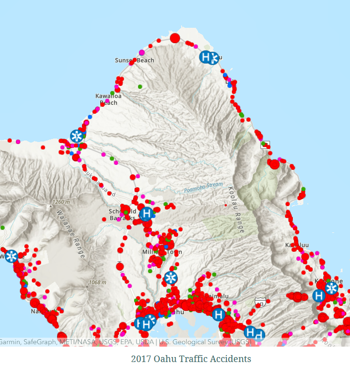
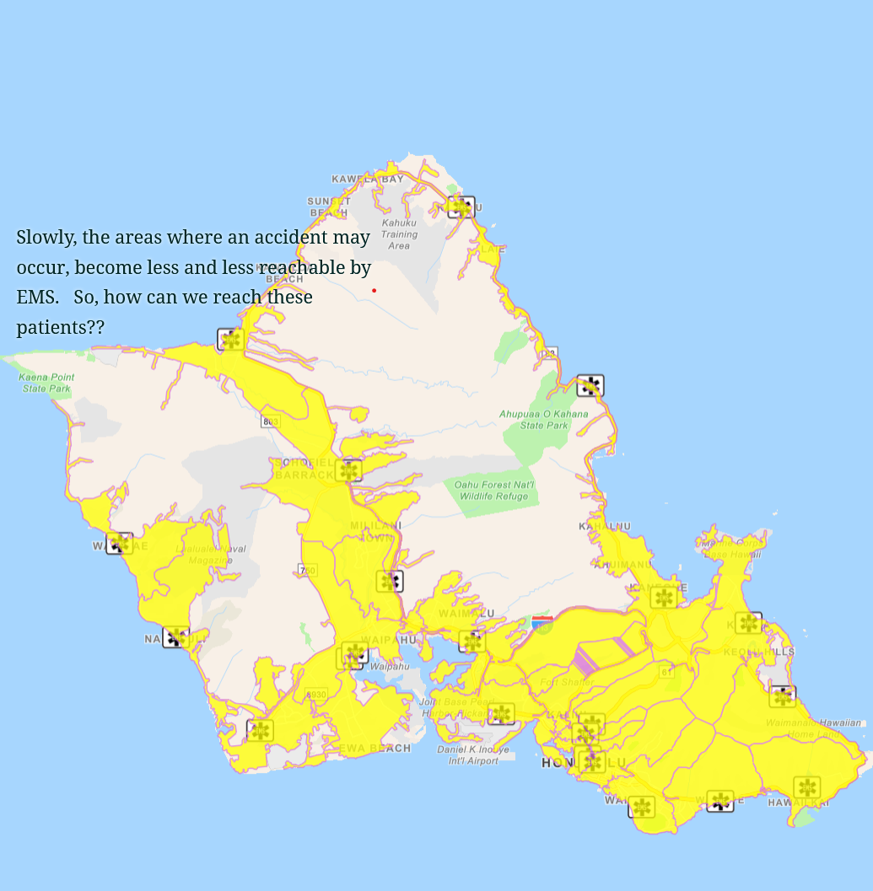
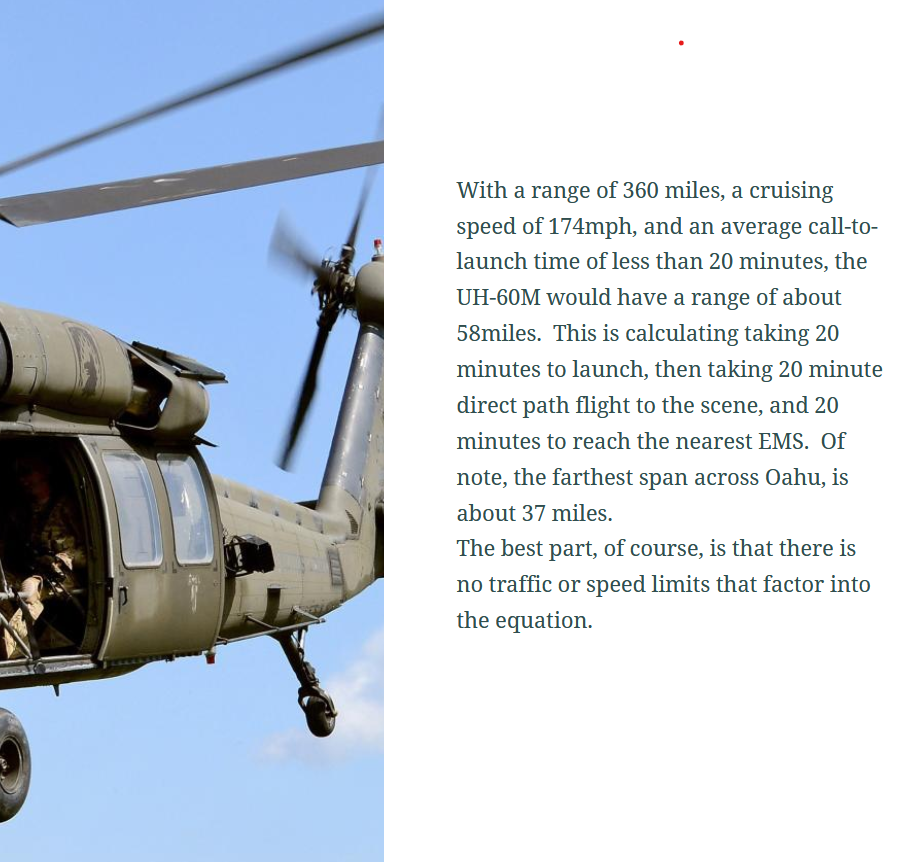

  
  
  

The overall goal of this project was to explore the ability of a helicopter HUMEVAC program to fulfill a currently unmet need of getting patients to emergency medical within one hour during high-traffic hours.  Several datasets were required to provide adequate feasibility recommendations.

The first, traffic accidents reported.  The location of these reported accidents was the starting point for determining whether medical services would be able to get to a location and to a nearby hospital, within one hour.  After this, data was overlayed corresponding to the nearest Ambulance stations, Heli-pad locations, and hospital locations. From here, data was processed to determine the time it would take an ambulance in traffic to reach an accident and a hospital within one hour.  The same processing, given the characteristics of a UH-60M helicopter, was done and used to determine that anywhere on island could be reached as medical response.  Limitations of the UH-60M were the gradient of the landing area had to be less than 7 degrees in order to safely land and HUMEVAC.  Processing in ArcGIS broke down the areas that the helicopter could and could not safely land in all parts of the island.  

All data was acquired as JSON datasets from the State of Hawai’I ArcGIS web portal, and processed in ArcGIS online or ArcGIS Pro.  

https://storymaps.arcgis.com/stories/47e9432e980647aaa19ad8b8d2b05744

